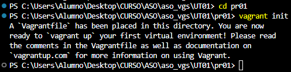
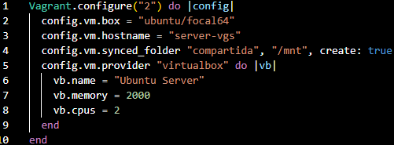
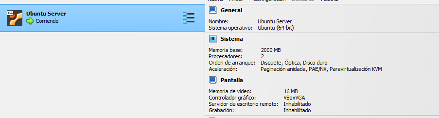
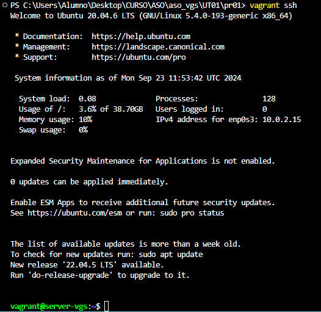

# Pasos necesarios para realizar la practica
### Victor Gonzalez Suarez

### Lo primerisimo de todo seria descargar la imagen de la url https://portal.cloud.hashicorp.com/vagrant/discover?query= y añadirla con el comando vagrant add box y el nombre de la imagen para descargarla en nuestro equipo

### 1 Primero inciamos en vagrant en el directorio para que nos cree el fichero de configuracion vagrantfile

### 2 Una vez creado el fichero nos vamos a configurarlo con las caracteristicas necesarias. En la imagen se ve las configuraciones del hostname fuera de las configuraciones de la propia maquina ya que el nombre de la maquina y memoria etc van dentro del nivel de configuracion de virtualbox

### 3 Por ultimo vamos a levantar la maquina ya con la configuracion completa

### Como podemos comprobar tenemos la configuracion actualizada en virtual box

### Iniciamos la maquina
