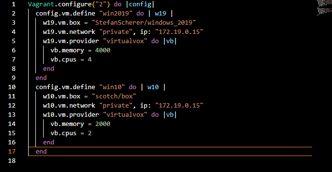
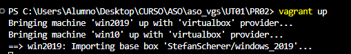

# Pasos a realizar para cumplir los objetivos:

### Paso 1 Iniciamos el vagrant init en el directorio para que me cree el fichero vagrantfile
### Paso 2 Se descargan las imagenes de Vagrant boxes
### Paso 3 Se cofigura el fichero vagrant file teniendo en cuenta que ahora queremos dos maquinas en el mismo por tanto hay q unsar el vagrant define poniendole previamente el nombre de como vas a llamar a la maquina a la hora de conectarte con ssh y despues un parametro para referirte en el fichero de configuracion.

### Por ultimo iniciamos las maquinas

### Nos conectamos

