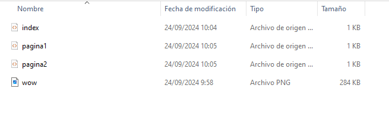

# Respuesta
### Victor Gonzalez Suarez

### Paso 1 Iniciamos vagrant init en el directorio donde vamos a alojar el vagrantfile

### Paso 2 Descargamos la imagen que nos pide de aqui https://portal.cloud.hashicorp.com/vagrant/discover?query=

### Paso 3 comprobamos que se ha añadido a nuestras imagenes con el comando vagrant list

### Paso 4 configuramos el fichero Vagrantfile en el que vemos los dos adaptadores y las caracteristicas que nos pide el enunciado.

### Paso 5 levantamos la maquina

### Paso 6 Instalamos el servidor apache desde la maquina

### Paso 7 Creamos una carpeta sincronizada en el directorio para realizar el archivo html y asi editarlo mejor en la maquina fisica

### Paso 8 Comprobamos que salen los archivos
