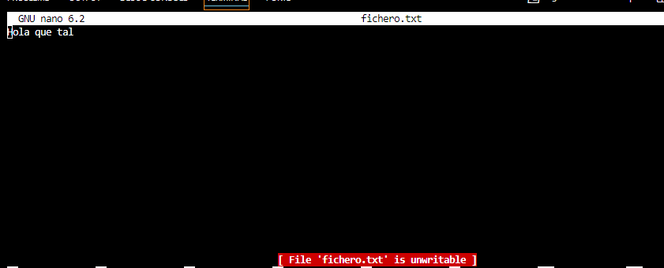

# Solucion PR0201

# Apartado 1
### 1.- Tanto uno como el otro directorio tiene permiso total es decir que tanto el usuario propietario (vagrant) como el grupo tienen permiso de lectura escritura y ejecucion mientras que el resto de usuarios solo pueden leerlo y ejecutarlo pero no escritura

### 2.- Para eliminar los permisos de escritura ```chmod ugoa-w dir2```

### 3.- ```chmod 551 dir2```

### 4.- ```Con ls -l vemos que los permisos ahora son para el propietario lectura y ejecucion para los grupos el mismo y para otro usuarios ninguno```

### 5.- ```mkdir dir2```

### 6.- ```chmod 751 dir2```/////```mkdir dir21```

# Apartado 2

### 1 .- ```chmod a+x file; chmod g+w file```

### 2 .- ```chmod u+x file```

### 3 .- ```chmod u-r file; chmod o-r```

### 4 .-```chmod u+x file; chmod g-x file; chmod o+x file```

### 5 .-```chmod u+x file; chmod g-x file; chmod o+x file```

### 6 .-```chmod u-w file; chmod u+x file; chmod g-r file chmod g+x file; chmod o-r file; chmod o+x file```

### 7 .-```chmod u-r file; chmod o-r file; chmod o+x file```

### 8 .-```chmod u-w file; chmod u-r file; chmod g-r file; chmod o+r file; chmod o+x file; chmod o+w file```

### 9 .-```chmod u-w file; chmod g-r file; chmod g+w file; chmod o-r file; chmod o+x file```

### 10 .-```chmod u+w file; chmod u-r file; chmod g-r file; chmod o-r file```

### 11 .-```chmod o-r file```

### 12 .-```chmod u-x file; chmod g-r file; chmod g+x file; chmod o+x file; chmod o-r file```

# Apartado 2.1

### Ahora en Octal

### 1 .- ```chmod 775 file```

### 2 .- ```chmod 111 file```

### 3 .- ```chmod 421 file```

### 4 .- ```chmod 200 file```

### 5 .- ```chmod 640 file```

### 6 .- ```chmod 711 file```

### 7 .-```chmod 755 file```

### 8 .-```chmod 511 file```

### 9 .-```chmod 241 file```

### 10 .-```chmod 017 file```

# Apartado 3

### Bit setgid

1 .- 
2 .- 
3 .- 
4 .- 
5 .- 
6 .- 
7 .- 

### El bitsetguid tiene la ventaja de que otros usuarios no pueden modificar mis ficheros no tengo que cambiar los permisos todos el rato cada vez que haya un usuario nuevo

### Sucede que cualquiera puede modificarte los ficheros si no le cambias los permisos previamente.

