# Conexion remota SSH

### 1.- Preparacion de la maquina y configuracion de red

1.- 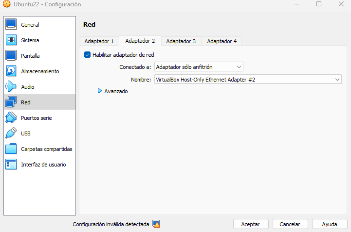
2.- 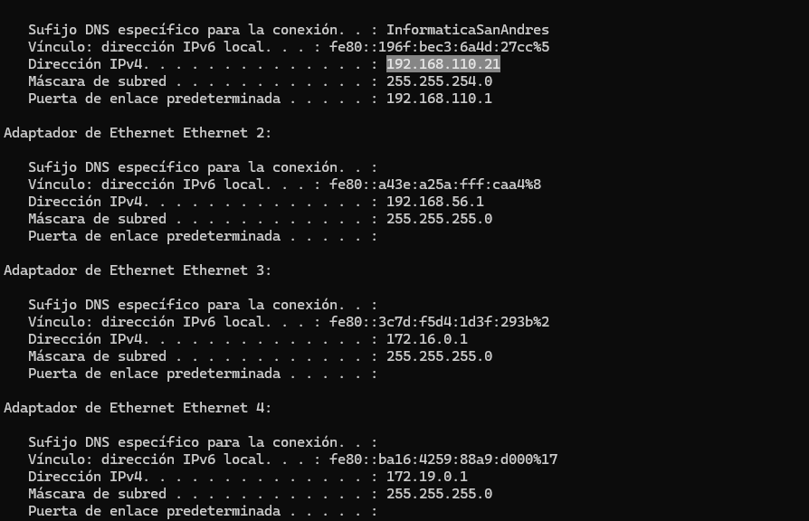
3.- 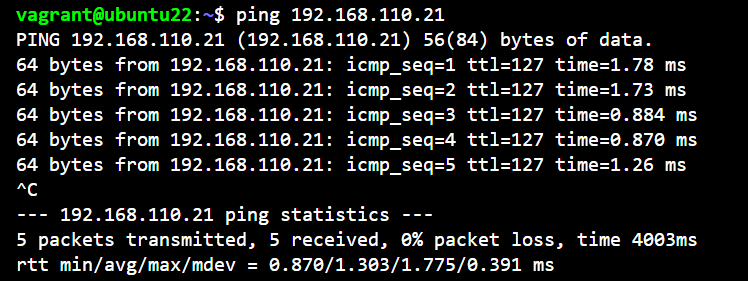
4.- 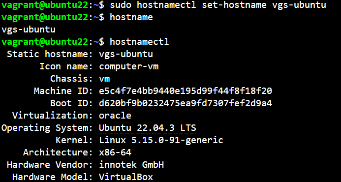
5.- 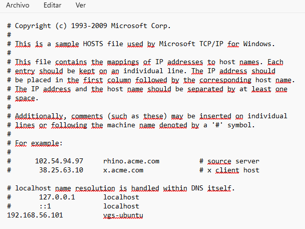

### 2.- Creacion de usuario y conexion ssh

1.- 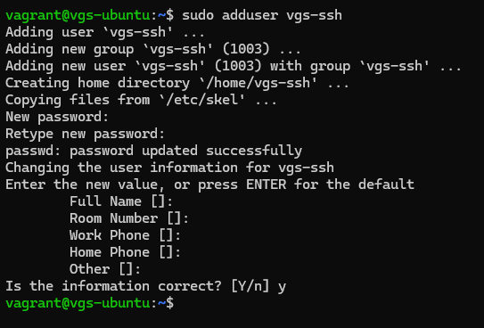
2.- 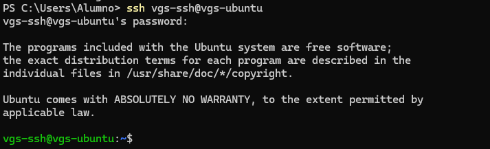
3.- 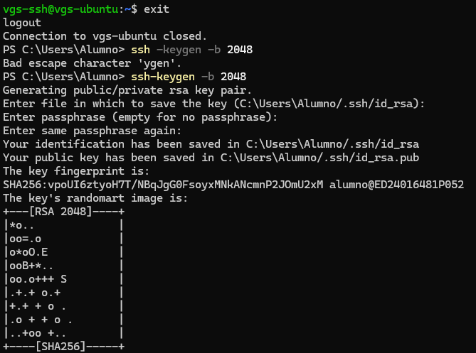
4.- 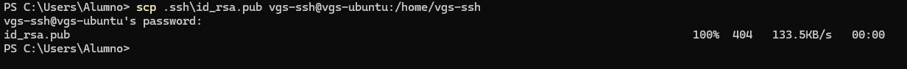
5.- 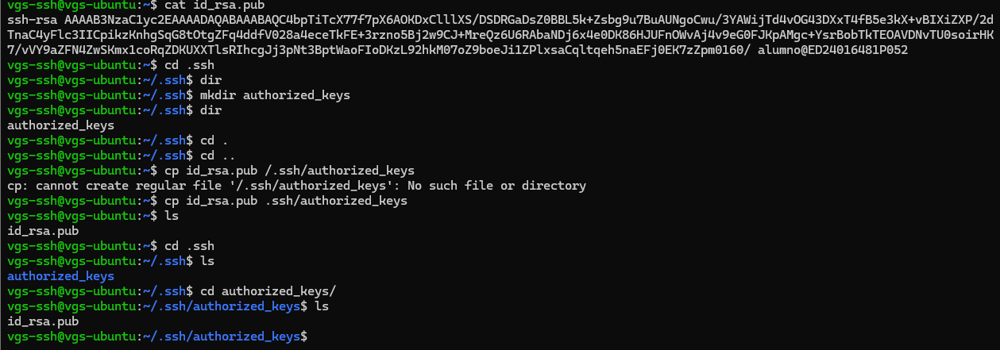
6.- 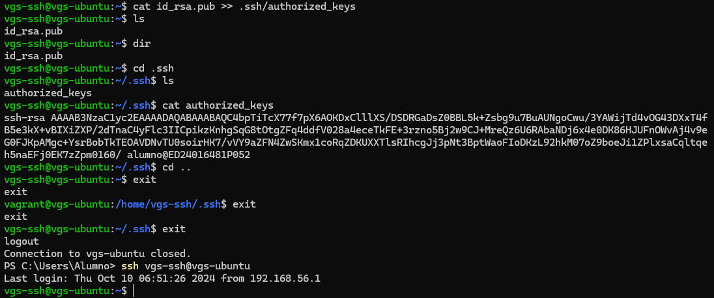

### 3.- GitHub Conexion

1.- 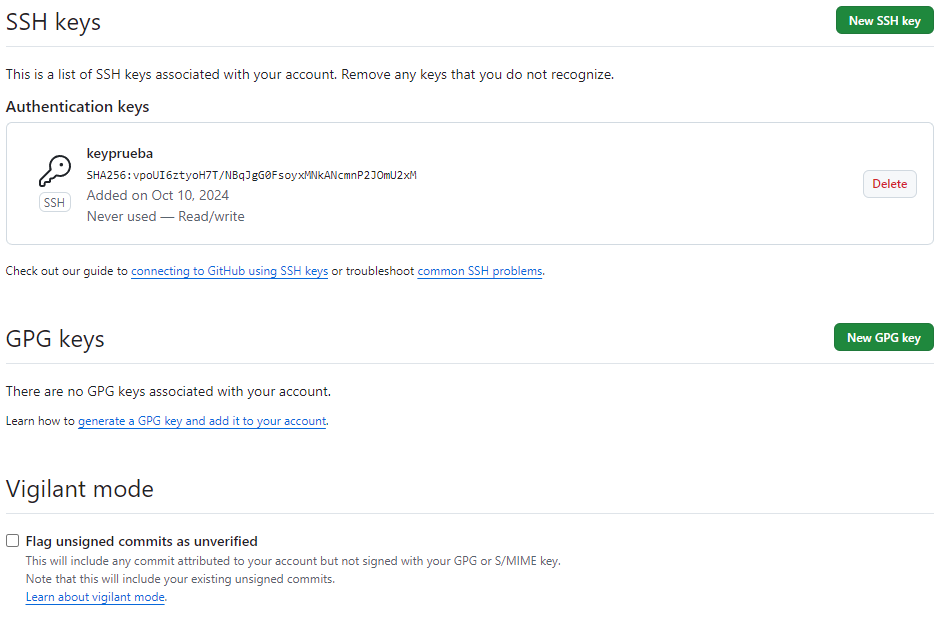
Lo primero es copiar en l portapapeles tu clave publica y pegarla en settings de tu perfil en github

2.- 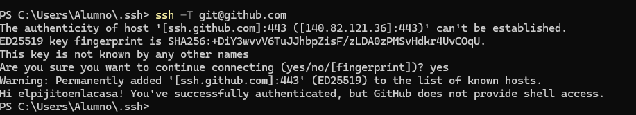
Despues se crea un fichero config en la carpeta .ssh porque el puerto del centro esta capado y asi cambiando de puerto probamos la conexion y comprobamos q funciona