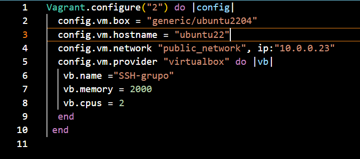
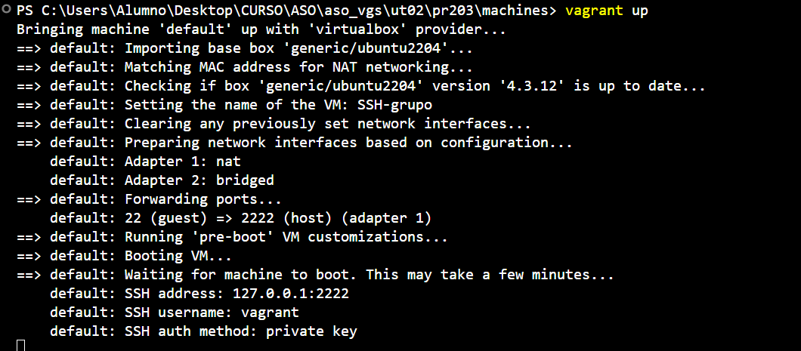
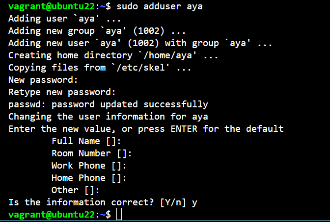
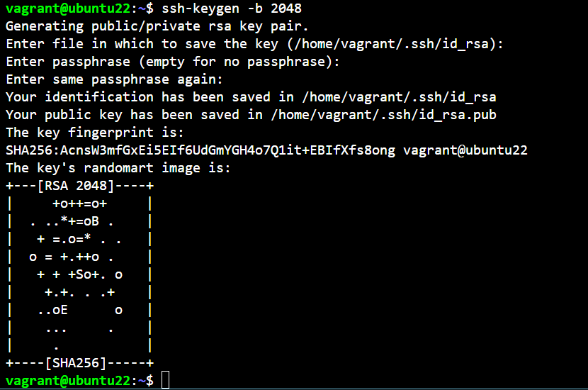
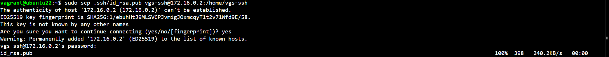
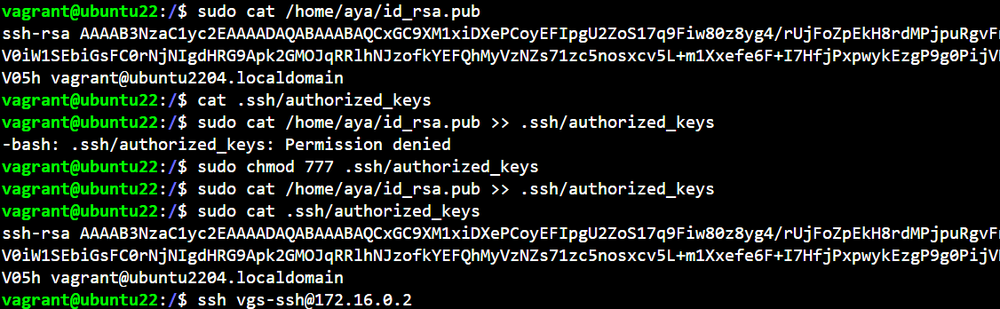
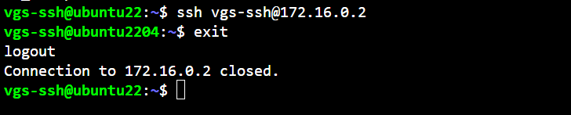

# Solucion Practica SSH Grupal

### Primero, Hago el fichero Vagrant file para configurar mi nueva maquina se le easigna unn  adaptador publico.

1.- 

### Levantamos la maquina

2.- 

### Creo el ususario de Asier con sus iniciales 

3.- 

### Creo la Clave publica 

4.- 

### Le mando la Clave a asier

5.- 

### Copiamos la vclabe en el directorio .ssh que ha habido que crear y en un fichero llamado authorized keys

6.- 

### Comprobamos conexion 

7.- 

*   13   *
59  12   1  NO
00  13   1  SI
01  13   1  SI
..
59  13   1  SI
00  14   1  NO