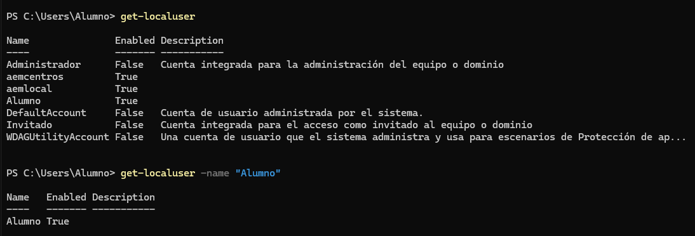
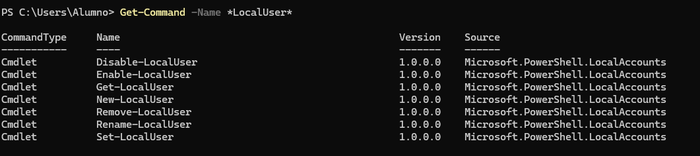
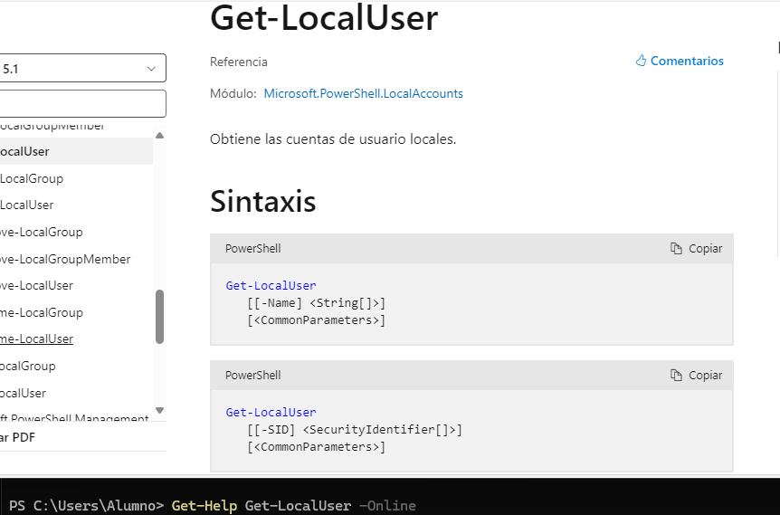
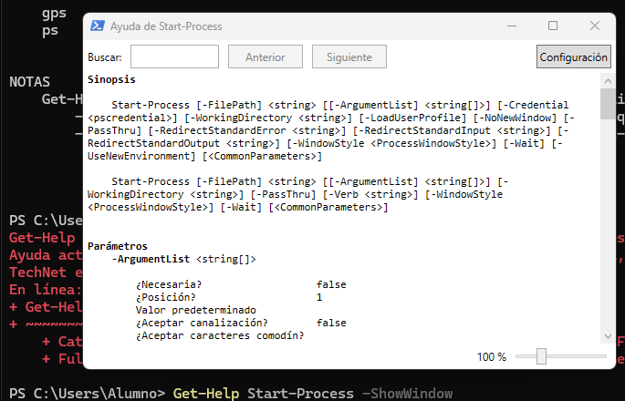
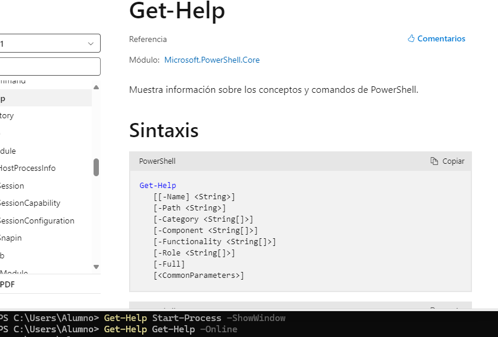
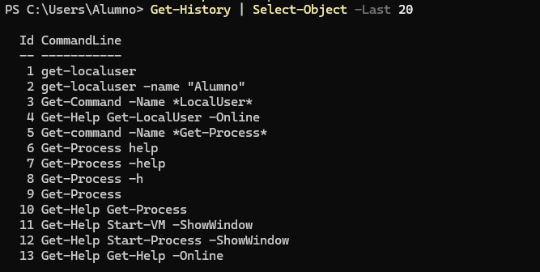
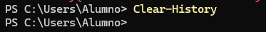

# Realiza las siguientes tareas que se te piden utilizando Powershell. Para contestar lo mejor es que hagas una captura de pantalla donde se vea el comando que has introducido y las primeras líneas de la salida de este.

### 1.- Obtén ejemplos de utilización del comando Get-LocalUser.



### 2.- Obtén un listado de todos los comandos relacionados con la gestión de usuarios locales (es decir, con el nombre LocalUser).



### 3.- Utilizando la línea de comandos, muestra en el navegador la ayuda del comando Get-LocalUser.



### 4.- Averigua para qué sirve el comando Set-Content y explícalo brevemente con tus palabras.

- El comando ```Set-Content``` escribe datos en un archivo o crea uno nuevo si no existe. Se utiliza para sobrescribir contenido.

### 5.- Explica tres formas diferentes de ver o buscar un comando que hayas utilizado anteriormente en tu sesión.

```Get-History``` // ```teclas arriba abajo```//```Get-History | Where-Object CommandLine -like "*Get-LocalUser*"```

### 6.- Averigua si el comando Get-Process tienen un parámetro llamado ComputerName y en caso afirmativo explica para qué sirve.

No, el comando Get-Process no tiene un parámetro ComputerName. Para interactuar con procesos en sistemas remotos, hay que usar Invoke-Command

### 7.- Muestra la ayuda del comando Start-VM en una ventana emergente.



### 8.- Muestra la ayuda del comando Get-Help en el navegador invocándolo desde la línea de comandos.



### 9.- Muestra las últimas 20 entradas del historial.



### 10.- Elimina las entradas 10, 12 y 14 de tu historial.

