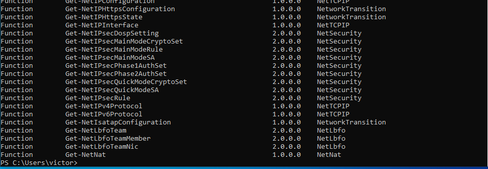

## Realiza las siguientes tareas que se te piden utilizando Powershell. Para contestar lo mejor es que hagas una captura de pantalla donde se vea el comando que has introducido y las primeras líneas de la salida de este.

### 1.- Visualiza las últimas cinco entradas del historial, mostrando para cada una el comando, la hora en que finalizó su ejecución y el estado de ejecución.

```` Get-History | Select-Object -Last 5 | Format-Table CommandLine, EndExecutionTime, Status ````

### 2.- Ejecuta el comando Get-Command (que muestra todos los comandos disponibles en Powershell) e interrúmpelo antes de que finalice su ejecución pulsando las teclas Ctrl-C. A continuación, ejecútalo dejando que finalice correctamente.



### 3.- Vuelve a ejecutar el comando del punto 1 y comprueba las diferentes salidas de finalización de estado de ejecución.

```Get-History | Select-Object -Last 5 | Format-Table CommandLine, EndExecutionTime, Status```

### 4.- Muestra todos los procesos con el nombre msedge mostrando para cada uno el identificador, el consumo de CPU y los hilos (threads)

```Get-Process msedge | Select-Object Id, CPU, Threads```

### 5.- Averigua para qué sirve el parámetro -Delimiter del comando Export-CSV

```Para cambiar el delimitador a la hora de poner un comando```

### 6.- Muestra en una ventana la ayuda del comando Get-History

```Get-Help get-history```

### 7.- Muestra un listado con todos los comandos que tengan el verbo Update.

```get-command -verb update```

### 8.- Ejecuta la herramienta Recortes y localízala usando el comando Get-Process teniendo en cuenta que el proceso se llama SnippingTool.exe

```get-process -name snippingtool.exe```

### 9.- Averigua qué propiedades tienen los procesos devueltos con el comando Get-Process.

```get-process | get-member membertype property```

### 10.- Busca en la ayuda para qué sirve el parámetro -MemberType del comando Get-Member.

```Sirve para filtrar por tipo de propiedad (propiedades, métodos, etc.)```

### 11.- Desde la línea de comandos, finaliza la ejecución de la herramienta Recortes.

```stop-process snippingtool.exe```

### 12.- Muestra todos los procesos que tienen el nombre svchost.

```get-process svchost```


### 13.- Muestra por pantalla el número de instancias del proceso svchost.

```get-process svchost | measure-object -property id -maximum```

### 14.- Muestra por pantalla todos los procesos con el nombre svchost mostrando para cada uno: nombre, identificador, hora de inicio, tiempo total de procesador y clase de prioridad. Se deben mostrar de forma tabular.

```get-process svchost | select-object name, id, starttime, cpu, priorityclass | format-table -property name```

### 15.- Repite la búsqueda anterior, pero ordenando por el campo tiempo total de procesador en sentido descendente.

```get-process svchost | select-object name, id, starttime, cpu, priorityclass | sort-object cpu -descending```

### 16.- Muestra los usuarios que hay en el sistema agrupándolos por la propiedad Enabled.

```get-localuser | group-object -property enabled``````

### 17.- Muestra los usuarios que hay en el sistema con la cuenta habilitada (propiedad Enabled puesta a True). Utiliza el filtrado con el comando Where-Object

```get-localuser | where-object {$_.enabled -eq $true}```

### 18.- Muestra un listado de todos los usuarios del sistema con el nombre y la fecha de la última vez que iniciaron sesión (tienes que buscar la propiedad que indique último inicio de sesión o last logon)

```get-localuser | select-object name, lastlogondate```