# Paso 1.- Configuramos la red de la maquina y la cambiamos el nombre para que se vean entre ellas
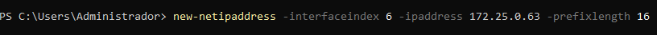

### Desactivamos el firewall y comprobamos que se ven entre ellas haciendo ping
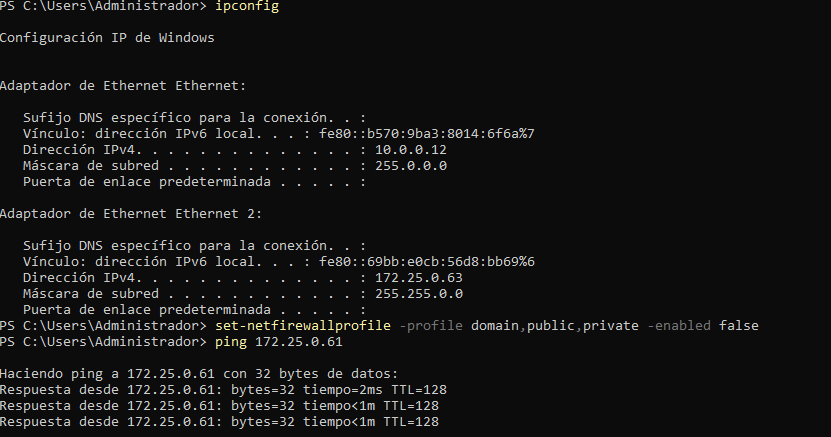
### Cambiamos tambien el hostname
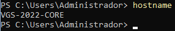

# Paso 2.- Configuracion de acceso remoto al equipo
### Desde el equipo core nuevo habilitamos el remoting
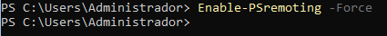
### Vamos ahora al equipo desde el que gestionaremos (winserver de escritorio)
### vemos primero el archivo trusted host y comprobamos que falta la ip que tenemos que meter
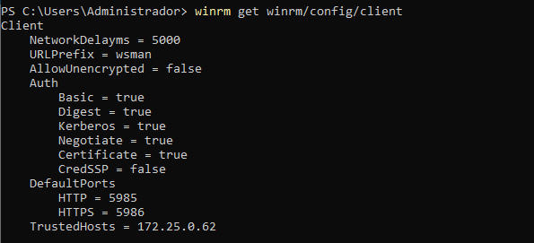
### Añadimos dicha ip
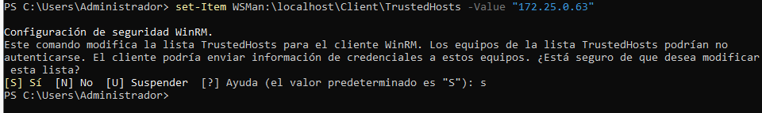
### comprobamos q se añadio bien
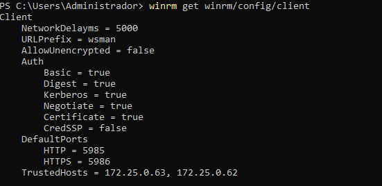
# Ahora ya se pueden enviar comandos a esa ip tambien

# Paso 3.- Creacion de usuarios de manera remota
### Usamos el invoke command para crear los usuarios primero en una ip y luego en otra
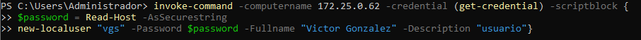
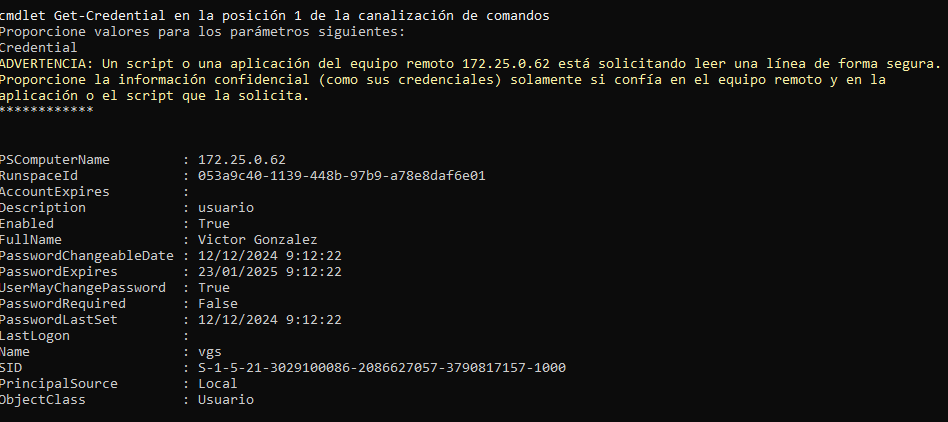
### Ahora lo mismo en la otra ip
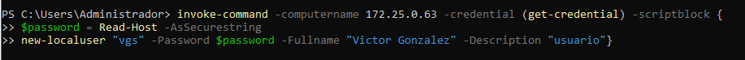
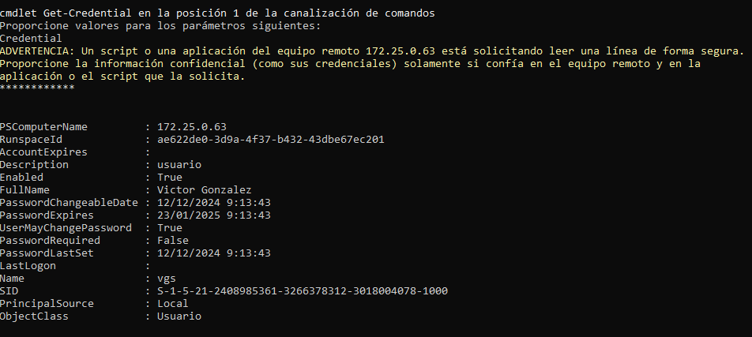
# Paso 4.- HTTPS
### Configuramos el certificado
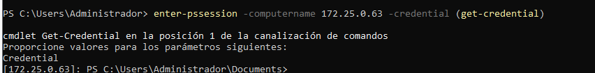
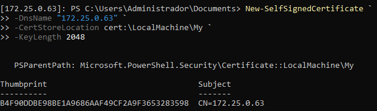
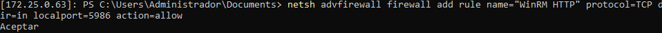
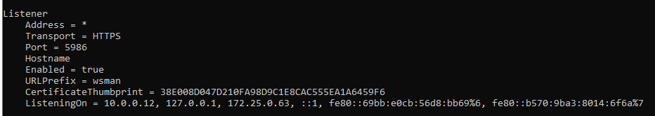
### Aqui comprobamos que escucha en el listener creado por https con su certificado
