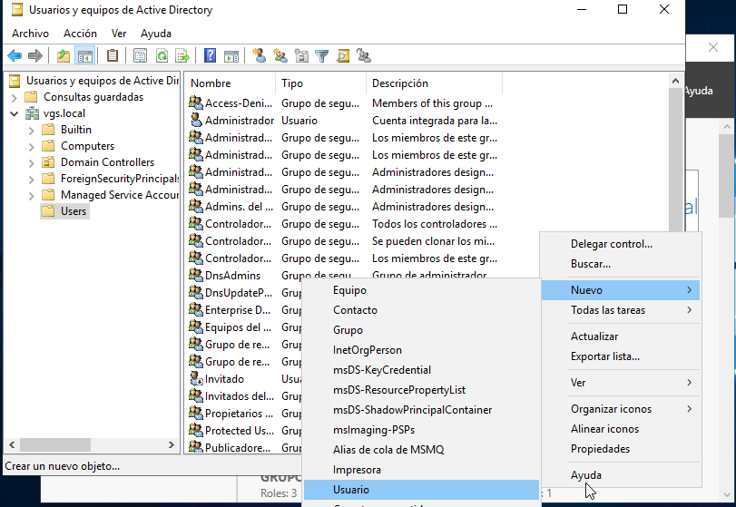
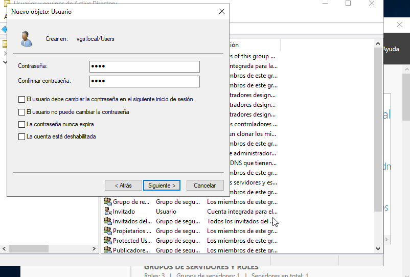
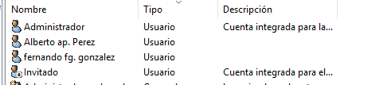
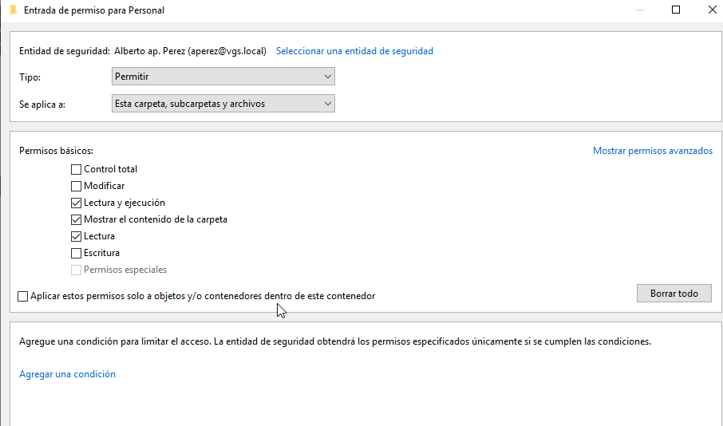
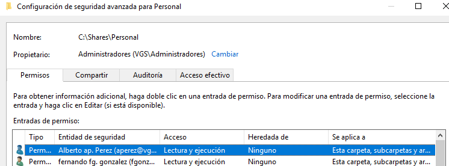
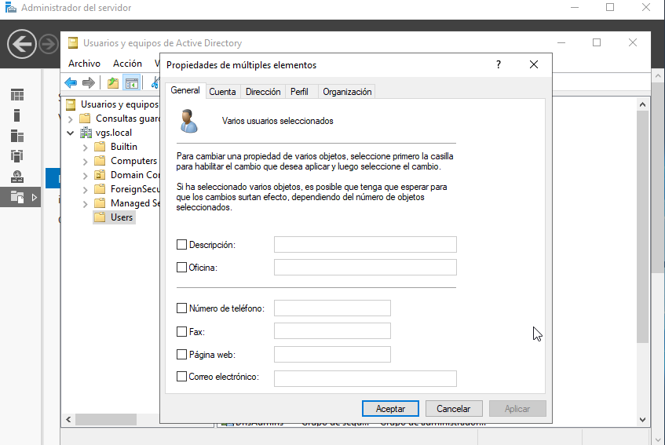
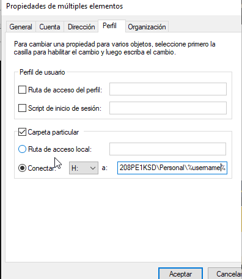
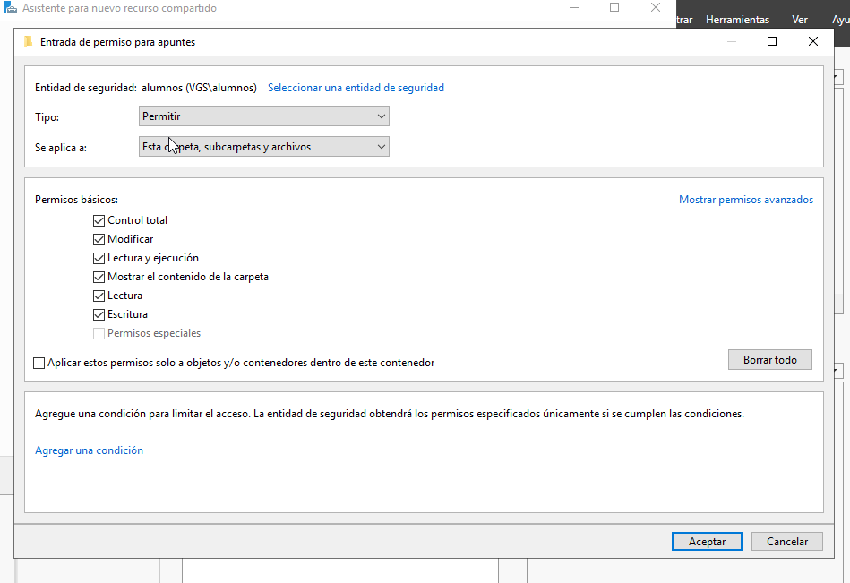
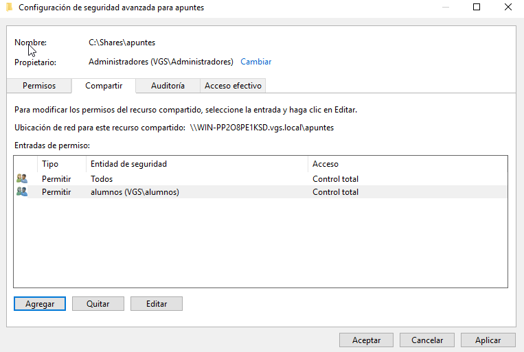
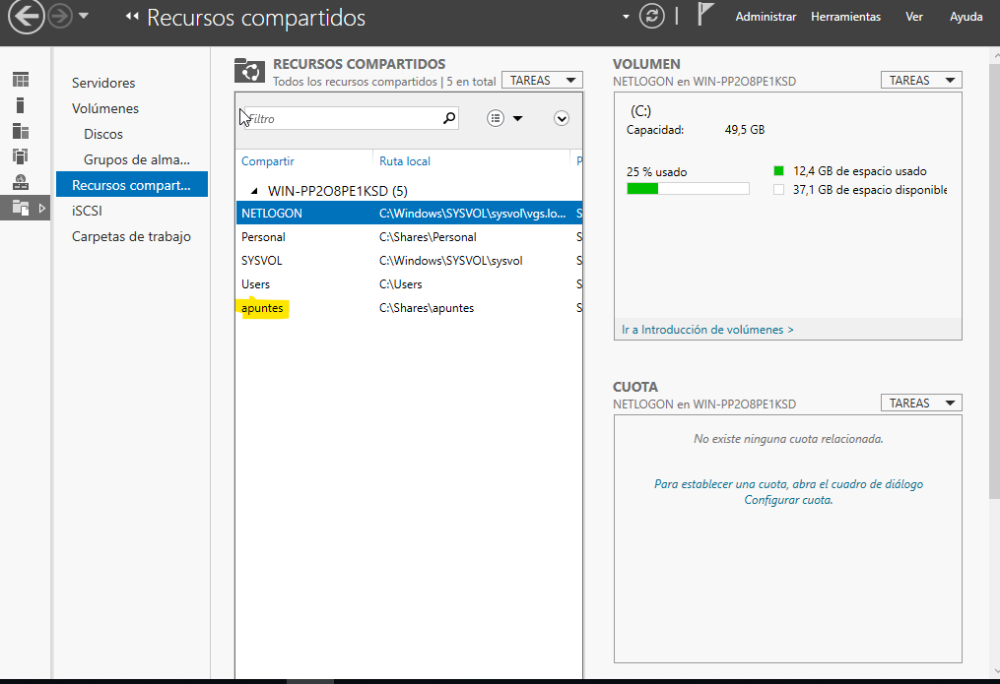

### Creacion de Usuarios

### Carpetas personales
### Le damos los permisos

### ahora vamos a ponerle la ruta en la pestaña perfil

### creamos el nuevo recurso compartido y se lo asignamos al grupo alumnos

